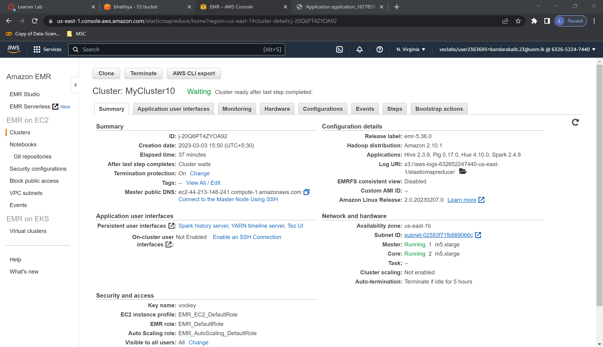
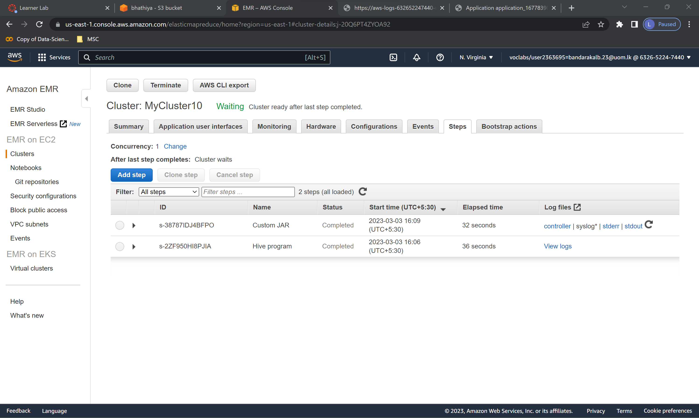
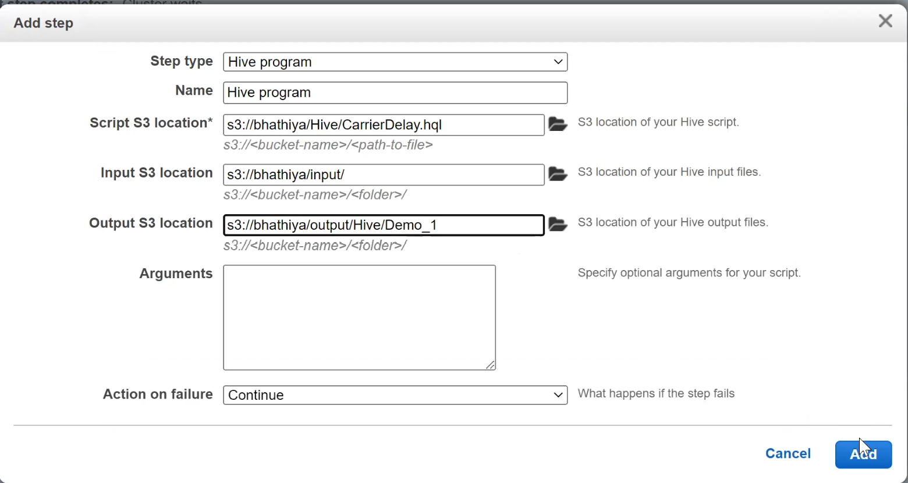
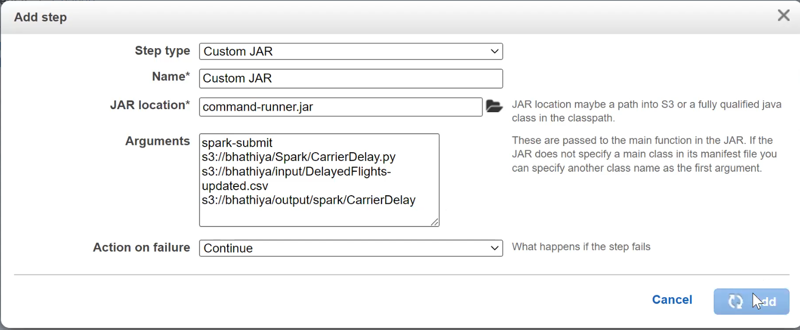
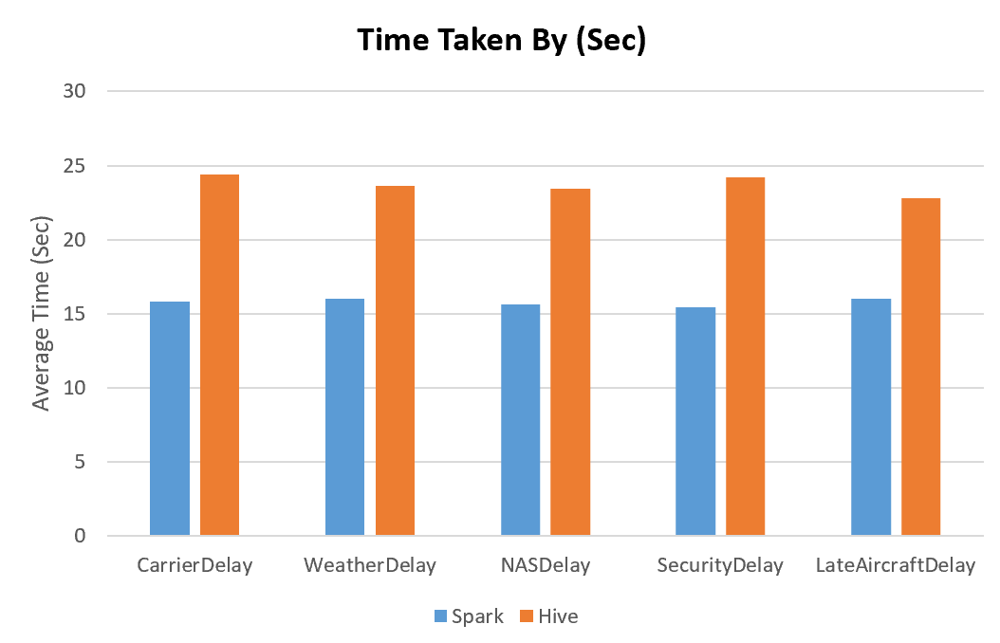

# MapReduce and Apache Spark
In this we are comparing MapReduce and Spark performance by running several tasks simultaneously and measuring their job execution time. We are using Amazon EMR cluster with Hive and PIG as our Hadoop cluster. In order to measure the execution time, we deploy Hive scripts because hive use MapReduce. First, upload all the script and input files to S3 bucket. Then go to EMR cluster.

## Task run procedure 
Following is my EMR cluster details 

Then go to the step menu:

Then use following method to add steps
### Hive

### Spark

## Results
following is the average time taken for different jobs by Hive and Spark. Based on the results, as expected, we can see that Spark Performance is much better than the Hadoop Hive. You can see more details of job execution times in [this](Job_execution_times.xlsx) file

# Dataset
Detail descrition of the dataset can be found from [here](https://www.kaggle.com/code/adveros/flight-delay-eda-exploratory-data-analysis/notebook).

